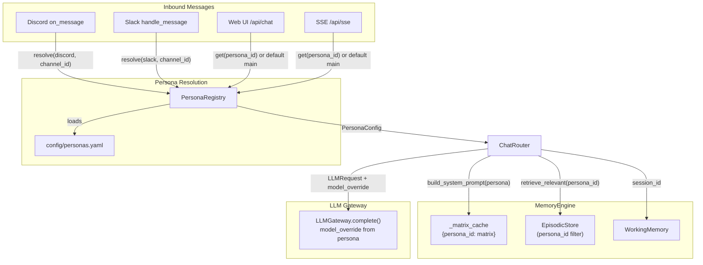

# Multi-Persona Support for Talon (Phase 7 Extension)

## Architecture

Personas are **identity layers**: different core matrices, different system prompts, same skills, same physical episodic table (with persona-scoped retrieval). Resolution happens at the integration boundary -- Discord/Slack/webhook resolve `(platform, channel_id)` to a `PersonaConfig`, which threads through ChatRouter to MemoryEngine.




## Data Flow

1. Integration receives message with `(platform, channel_id)`
2. `PersonaRegistry.resolve(platform, channel_id)` returns `PersonaConfig` (falls back to `"main"`)
3. `ChatRouter.process()` receives `PersonaConfig` and threads it to:
  - `MemoryEngine.build_system_prompt(persona=...)` -- loads persona-specific core matrix from `persona.memories_dir`, caches per persona_id
  - `EpisodicStore.retrieve_relevant(persona_id=...)` -- scoped cosine similarity / recency
  - `EpisodicStore.save_turn(persona_id=...)` -- tags new rows
  - `LLMGateway.complete(request)` where `request.model_override = persona.model_override`

## Files to Create

### `config/personas.yaml`

Defines all personas. `channel_bindings: []` makes `main` the catch-all fallback.

```yaml
personas:
  main:
    memories_dir: data/memories/main
    model_override: null
    channel_bindings: []
  analyst:
    memories_dir: data/memories/analyst
    model_override: null
    channel_bindings:
      - platform: slack
        channel_id: "PLACEHOLDER"
      - platform: discord
        channel_id: "PLACEHOLDER"
```

### `backend/app/personas/__init__.py` and `backend/app/personas/registry.py`

~60 lines. `PersonaConfig` dataclass + `PersonaRegistry` class with:

- `resolve(platform, channel_id) -> PersonaConfig` -- reverse-lookup from `_channel_map`, falls back to `"main"`
- `get(persona_id) -> PersonaConfig` -- direct lookup, falls back to `"main"`
- `all_personas() -> dict[str, PersonaConfig]` -- for sentinel to know all watched dirs

### `data/memories/main/` -- move existing files

Move `data/memories/*.md` into `data/memories/main/` (identity.md, user_preferences.md, long_term.md, capabilities.md).

### `data/memories/analyst/`

New persona memory files: `identity.md` (tight financial analyst framing), `watchlist.md`, `market_context.md`, `capabilities.md` (same tools, different framing).

### Alembic migration

New file in `backend/alembic/versions/`. Adds:

```sql
ALTER TABLE episodic_memory ADD COLUMN persona_id VARCHAR(64) NOT NULL DEFAULT 'main';
CREATE INDEX ix_episodic_persona ON episodic_memory (persona_id);
```

### `backend/tests/test_personas/test_registry.py`

Tests: resolution by channel, fallback to main, direct get, unknown persona falls back.

### `backend/tests/test_memory/test_episodic_persona.py`

Tests: save_turn tags persona_id, retrieve_relevant scoped by persona_id.

## Files to Modify

### `[backend/app/models/episodic.py](backend/app/models/episodic.py)`

Add `persona_id` mapped column:

```python
persona_id: Mapped[str] = mapped_column(
    String(64), default="main", nullable=False, index=True
)
```

### `[backend/app/memory/episodic.py](backend/app/memory/episodic.py)`

- `save_turn()` gains `persona_id: str = "main"` param, sets it on each `EpisodicMemory` entry
- `retrieve_relevant()` gains `persona_id: str = "main"` param, adds `.where(EpisodicMemory.persona_id == persona_id)` filter
- `count_active()` gains optional `persona_id` filter

### `[backend/app/memory/engine.py](backend/app/memory/engine.py)`

Major refactor to support multi-persona:

- Constructor changes: replace `memories_dir` / `core_matrix_path` / `_core_matrix` with `_matrix_cache: dict[str, dict]` and `_base_data_dir: Path`
- New `_load_or_compile_for_persona(persona: PersonaConfig) -> dict` -- checks `_matrix_cache`, loads/compiles per persona, caches result
- New `recompile_persona(persona_id: str, memories_dir: Path)` -- called by sentinel on file change
- New `invalidate_cache(persona_id: str)` -- evict one persona from cache
- `build_system_prompt()` gains `persona_id: str = "main"` and `persona_memories_dir: Path | None = None` params (or accepts a `PersonaConfig` directly)
- `core_matrix` property becomes `get_core_matrix(persona_id)` since there's no single matrix anymore
- Episodic calls pass `persona_id` through

### `[backend/app/api/chat.py](backend/app/api/chat.py)`

- `ChatRequest` gains `persona_id: str = Field(default="main", max_length=64)` -- enables web UI persona switching (Option B from spec)
- `chat()` endpoint resolves `PersonaConfig` via registry, threads through `build_messages` and `save_turn`
- New dependency: `get_persona_registry`

### `[backend/app/api/chat_router.py](backend/app/api/chat_router.py)`

- `build_messages()` gains `persona_id: str = "main"` and `persona_memories_dir: Path | None = None` params, passes to `memory.build_system_prompt()`
- `save_turn()` gains `persona_id: str = "main"`, passes to `episodic_store.save_turn()`
- `run_tool_loop()` gains `model_override: str | None = None`, passes through `LLMRequest`

### `[backend/app/api/sse.py](backend/app/api/sse.py)`

- SSE endpoint gains optional `persona_id` query param (default `"main"`)
- `_event_stream()` gains `persona_id` param, threads through `build_messages`
- Resolves `PersonaConfig` via registry for model_override and memories_dir

### `[backend/app/llm/models.py](backend/app/llm/models.py)`

- `LLMRequest` gains `model_override: str | None = None`

### `[backend/app/llm/gateway.py](backend/app/llm/gateway.py)`

- `_call_provider()`: if `request.model_override` is set, use it as the `model` param to LiteLLM instead of `provider.model`
- `_stream_from_provider()`: same override logic

### `[backend/app/integrations/manager.py](backend/app/integrations/manager.py)`

- `make_chat_callback()` accepts `persona_registry: PersonaRegistry`
- Chat callback signature gains `persona_id: str = "main"`, threads through `build_messages` and `save_turn`
- For integrations, the callback receives persona_id from the integration layer

### `[backend/app/integrations/slack.py](backend/app/integrations/slack.py)`

- `SlackIntegration.__init__()` accepts `persona_registry: PersonaRegistry | None`
- `_handle_slack_message()` calls `persona_registry.resolve("slack", channel)` to get `PersonaConfig`
- Passes `persona_id=persona.id` to `chat_callback`

### `[backend/app/integrations/discord.py](backend/app/integrations/discord.py)`

- `DiscordIntegration.__init__()` accepts `persona_registry: PersonaRegistry | None`
- `on_message` calls `persona_registry.resolve("discord", str(channel.id))` to get `PersonaConfig`
- Passes `persona_id=persona.id` to `chat_callback`

### `[backend/app/dependencies.py](backend/app/dependencies.py)`

- New `_persona_registry` global + `init_persona_registry(settings)` + `get_persona_registry()`
- `init_memory()` changes: accepts `PersonaRegistry`, initializes `MemoryEngine` with multi-persona support
- `init_integrations()` passes `PersonaRegistry` to integration constructors and `make_chat_callback()`
- `init_sentinel()` passes `PersonaRegistry` to `EventRouter`

### `[backend/app/main.py](backend/app/main.py)`

- Lifespan: call `init_persona_registry(settings)` before `init_memory()`, pass registry through

### `[backend/app/sentinel/tree.py](backend/app/sentinel/tree.py)`

- `EventRouter.__init__()` accepts `PersonaRegistry`
- `_is_memory_path()` returns `tuple[bool, str | None]` -- extracts persona_id from path (first subdir under memories_dir)
- `_reload_memory()` becomes persona-aware: `_reload_memory(persona_id)` calls `memory.recompile_persona(persona_id, memories_dir)`
- Sentinel watches `data/memories/` (parent of all persona dirs); file events route to correct persona

### `[backend/app/core/config.py](backend/app/core/config.py)`

- Add `personas_config_path` property: `project_root / "config" / "personas.yaml"`
- `memories_dir` property stays as `data/memories/` (now the parent of persona subdirs)

## Phase 8 CLI Updates (already completed, needs persona retrofit)

Since Phase 8 shipped before persona support, three CLI files need updates to avoid false failures and incorrect bootstrapping after the `data/memories/` restructure.

### `[backend/app/cli/doctor.py](backend/app/cli/doctor.py)`

- `**check_memories_dir()**` (lines 353-374): Currently does `mem_dir.glob("*.md")` at the top level of `data/memories/`. After restructure there are no top-level `.md` files -- only subdirs like `main/`, `analyst/`. Must change to iterate persona subdirectories and check each for `.md` files (or use `**/*.md` recursive glob).
- **New `check_personas_config()`**: Validate `config/personas.yaml` exists, parses, has a `"main"` persona, and each persona's `memories_dir` contains `.md` files. Add to `ALL_CHECKS` list.

### `[backend/app/cli/onboard.py](backend/app/cli/onboard.py)`

- `**_step_memory()**` (lines 168-191): Currently creates `identity.md` in `data/memories/`. Must create `data/memories/main/` and place `identity.md` there instead.
- **New `_step_personas()`** (optional but recommended): Bootstrap `config/personas.yaml` with a default `main` entry if it doesn't exist. Can be placed in the advanced setup flow.

### `[backend/app/cli/config_cmd.py](backend/app/cli/config_cmd.py)`

- `**_settings_to_dict()**` (line 71-81): Add `personas_config_path` to the displayed settings so `talon config show` reports it.

### `[backend/tests/test_cli/test_doctor.py](backend/tests/test_cli/test_doctor.py)` and `[backend/tests/test_cli/test_onboard.py](backend/tests/test_cli/test_onboard.py)`

- Doctor tests for `check_memories_dir` need to match the new persona-subdir structure
- Onboard tests for `_step_memory` need to assert files land in `data/memories/main/`
- New test for `check_personas_config`

---

### Existing tests to update

- `[backend/tests/test_memory/test_engine.py](backend/tests/test_memory/test_engine.py)` -- `MemoryEngine` constructor changes, `build_system_prompt` signature changes
- `[backend/tests/test_memory/test_episodic.py](backend/tests/test_memory/test_episodic.py)` -- `save_turn` and `retrieve_relevant` gain `persona_id`
- `[backend/tests/test_api/test_chat.py](backend/tests/test_api/test_chat.py)` -- `ChatRequest` now has `persona_id`
- `[backend/tests/test_api/test_sse.py](backend/tests/test_api/test_sse.py)` -- SSE gains `persona_id` param
- `[backend/tests/test_integrations/test_slack.py](backend/tests/test_integrations/test_slack.py)` -- callback signature changes, persona resolution
- `[backend/tests/test_integrations/test_discord.py](backend/tests/test_integrations/test_discord.py)` -- same
- `[backend/tests/test_sentinel/test_event_router.py](backend/tests/test_sentinel/test_event_router.py)` -- persona-aware dispatch

## Implementation Order

The order avoids rework -- each step builds on the previous:

1. **Alembic migration + ORM model** -- database ready for persona_id
2. **PersonaRegistry + config/personas.yaml** -- resolution logic exists
3. **MemoryEngine refactor** -- multi-persona core matrix cache + persona-scoped episodic
4. **EpisodicStore** -- persona_id on save/retrieve
5. **LLMRequest + Gateway model_override** -- minimal, no behavioral change when null
6. **ChatRouter + chat.py + sse.py** -- thread persona through web API path
7. **IntegrationManager + Slack + Discord** -- resolve persona at integration boundary
8. **Sentinel/EventRouter** -- persona-aware memory recompilation
9. **Move data/memories/ to data/memories/main/, create data/memories/analyst/**
10. **Dependencies + lifespan wiring** -- glue everything together
11. **CLI retrofit (Phase 8)** -- update doctor, onboard, config_cmd for persona-aware paths
12. **Update existing tests + write new persona tests** (including CLI tests)
13. **Update plan file** -- mark persona support as part of Phase 7

## Plan File Update

`[.cursor/plans/talon_implementation_strategy_3fab63f7.plan.md](.cursor/plans/talon_implementation_strategy_3fab63f7.plan.md)` Phase 7 todo content should be updated to include persona support:

> Phase 7: Integrations + Personas + Remaining Skills -- Discord, Slack, webhook receiver, **multi-persona support (PersonaRegistry, persona-scoped memory, channel-binding resolution)**, weather/email/news skills ported

Phase 7 deliverables should list:

- `config/personas.yaml` with main + analyst personas
- `PersonaRegistry` with channel-binding resolution
- Persona-scoped episodic memory (persona_id column + index)
- Per-persona core matrix caching in MemoryEngine
- model_override support in LLM gateway
- Persona resolution wired into Discord, Slack, webhook, web UI, SSE
- Sentinel persona-aware memory recompilation

