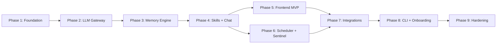

# CLI and Onboarding Phase for Talon

## Recommendation: New Phase, Not Integrated

After reviewing OpenClaw's onboarding wizard in depth (`src/wizard/onboarding.ts`, `onboarding.finalize.ts`, `prompts.ts`), I recommend a **dedicated new Phase 8** rather than scattering onboarding across existing phases. Three reasons:

1. **Dependency ordering** -- The wizard needs providers (Phase 2), memory (Phase 3), skills (Phase 4), the frontend (Phase 5), and integrations (Phase 7) to all exist before it can guide a user through configuring them. Integrating early would mean a half-working wizard that grows across 6 phases.
2. **Cohesion** -- The CLI framework, wizard, doctor, and config commands form a single operator-facing subsystem. Building them together means they share a prompter abstraction, consistent output formatting, and unified error handling.
3. **OpenClaw's lesson** -- OpenClaw's wizard is a mature, late-stage feature that wraps the entire system. It does not exist in pieces; it was designed as a single flow over a working gateway.

The existing `Makefile` targets remain the development interface for Phases 1-7. The CLI becomes the operator interface for ongoing management.

---

## What Transfers from OpenClaw (and What Does Not)

### Transfers directly (adapt to Python/Talon)

- Interactive wizard flow with QuickStart vs Advanced paths
- `WizardPrompter` abstraction (select, confirm, text, note, progress)
- Stepwise setup: secrets, providers, database, integrations, service install
- `doctor` command validating config, permissions, connectivity
- Health check probe at end of onboarding
- Shell completion setup
- Risk/security acknowledgement step

### Does NOT transfer (architectural differences)

- Gateway WS network probing (Talon uses HTTP/SSE, not WebSocket control plane)
- WhatsApp QR pairing / channel login (Talon uses token-based integration config)
- Daemon runtime selection (Node vs bun) -- Talon always uses systemd
- Tailscale Serve/Funnel automation
- TUI client launch
- Node pairing (iOS/Android/macOS)
- OAuth subscription rotation

---

## Proposed Phase 8: CLI and Onboarding

**Goal:** A `talon` CLI tool that guides operators through first-time setup, validates system health, and provides ongoing management commands.

**Depends on:** Phases 1-7 complete (all subsystems exist to be configured).

### CLI Framework

Use [typer](https://typer.tiangolo.com/) (built on click, type-hint driven, modern Python CLI). Add [rich](https://github.com/Textualize/rich) for formatted output (tables, panels, progress bars, prompts).

New file: `backend/app/cli/main.py` -- typer app with subcommands.

Entry point registered in `[project.scripts]` in `backend/pyproject.toml`:

```toml
[project.scripts]
talon = "app.cli.main:app"
```

### Subcommands

`**talon onboard**` -- Interactive wizard (primary deliverable)

Adapted from OpenClaw's `runOnboardingWizard()`, the flow for Talon:

```
1. Welcome + security notice
2. Flow selection: QuickStart / Advanced
3. Pre-flight checks:
   - Python 3.12+ present
   - Docker running
   - Disk space > 10 GB free
   - Port 5432 / 8000 / 8080 available
4. Secrets setup:
   - Generate or enter DB password -> config/secrets/db_password
   - Enter LLM API keys -> config/secrets/llm_api_keys (JSON)
   - chmod 700 config/secrets, chmod 600 files
5. Provider configuration:
   - Select primary provider (Anthropic/OpenAI/other)
   - Select model
   - Write config/providers.yaml
6. Database setup:
   - docker compose up -d (PostgreSQL + SearXNG)
   - Wait for healthy
   - alembic upgrade head
7. Memory bootstrapping:
   - Scaffold data/memories/ source files if missing
   - identity.md, user_preferences.md, capabilities.md
8. Config validation:
   - Load TalonSettings, verify all secrets resolve
   - Test DB connection
   - Test LLM provider reachability (single probe, not a full call)
9. Integration setup (optional, Advanced only):
   - Discord token -> config/secrets/discord_token
   - Slack tokens -> config/secrets/slack_*
10. Service installation:
    - Write/update deploy/systemd/talon.service
    - systemctl daemon-reload && systemctl enable talon && systemctl start talon
11. Frontend build:
    - cd frontend && npm install && npm run build
12. nginx setup:
    - Validate nginx config
    - nginx -s reload
13. Health verification:
    - curl /api/health, display formatted results
14. Summary:
    - Show URLs, next steps, security reminders
```

QuickStart uses sensible defaults and skips steps 9 (integrations) and 12 (nginx, assumes pre-existing). Advanced prompts for every option.

`**talon doctor**` -- Diagnostic validator

Modeled after OpenClaw's `openclaw doctor`:

```
- Config file permissions (config/secrets/ chmod 700, files chmod 600)
- config/talon.toml parseable (if exists)
- config/providers.yaml parseable
- Database connectivity (asyncpg connect + simple query)
- LLM provider reachability (HTTP HEAD to provider endpoints)
- Docker services running (docker compose ps)
- systemd service status
- Disk space check
- Log file writability
- Memory source files present
- Frontend build exists (frontend/dist/index.html)
- nginx config test (nginx -t)
```

Reports pass/fail/warn for each check with actionable fix hints.

`**talon config**` -- Config viewer

```
talon config show          # formatted display of current settings
talon config get db_host   # single value
talon config validate      # parse + validate only
```

Read-only. Config changes go through `talon onboard` or manual file editing (secrets must never be set via CLI args that end up in shell history).

`**talon status**` -- Unified status

Combines `make health` + `make status` into one formatted view:

- FastAPI health endpoint response
- Docker container statuses
- systemd service state
- Disk/memory usage summary

### File Structure

```
backend/app/cli/
  __init__.py
  main.py              # typer app, subcommand registration
  onboard.py           # onboard wizard flow
  doctor.py            # diagnostic checks
  config_cmd.py        # config viewer
  status.py            # unified status
  prompter.py          # WizardPrompter abstraction (rich-based)
  checks.py            # shared pre-flight / diagnostic check functions
```

### WizardPrompter (adapted from OpenClaw)

OpenClaw uses `@clack/prompts` (Node.js). Talon's equivalent uses `rich` + `typer.prompt()`:

```python
class WizardPrompter(Protocol):
    def intro(self, title: str) -> None: ...
    def outro(self, message: str) -> None: ...
    def note(self, message: str, title: str | None = None) -> None: ...
    def select(self, message: str, options: list[SelectOption]) -> str: ...
    def text(self, message: str, default: str = "") -> str: ...
    def confirm(self, message: str, default: bool = True) -> bool: ...
    def progress(self, label: str) -> ProgressContext: ...
```

This is a `Protocol` so it can be mocked in tests (same principle as OpenClaw's prompter injection pattern).

### Dependencies to Add

```toml
# In pyproject.toml [project.dependencies]
"typer>=0.15.0",
"rich>=13.9.0",
```

### Testing

- Mock `WizardPrompter` for automated test flows (same as OpenClaw's `clack-prompter.test.ts`)
- Test each diagnostic check independently with mocked subprocess/file state
- Integration test: run `talon doctor` against test DB (uses existing `db_session` fixture)
- No real LLM calls in onboard tests

### Phase 8 Verification on VPS

```
pip install -e .
talon onboard                 # walks through full setup
talon doctor                  # all checks pass
talon status                  # shows healthy system
talon config show             # displays current config
```

---

## Updated Phase Dependency Graph




Phase 9 (previously Phase 8) gains: Playwright E2E tests can exercise `talon onboard` and `talon doctor` as part of the hardening suite.

---

## Effort Estimate

- Phase 8 (CLI + Onboarding): **Medium** -- well-scoped, mostly glue code over existing subsystems. The wizard is logic-heavy but not algorithmically complex. Typer + Rich do most of the UI work.

---

## Changes to Existing Plan File

The [plan file](.cursor/plans/talon_implementation_strategy_3fab63f7.plan.md) needs:

1. Rename current Phase 8 to Phase 9 (update todo id, content, all references)
2. Insert new Phase 8 section between Phase 7 and renamed Phase 9
3. Update the mermaid dependency graph
4. Update the Phase Dependency Summary section
5. Update the Estimated Effort section
6. Add Phase 8 todo to the front matter

