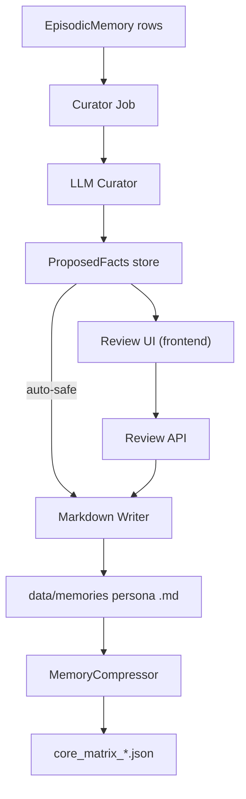

# Self-Updating Long-Term Memory

### Goal

Implement a background curation pipeline that promotes stable, persona-scoped facts from episodic memory into long-term knowledge, using Markdown in `data/memories/<persona>/` as the primary ground truth, while supporting eventual direct `core_matrix_*.json` updates if needed. Provide both automatic promotion for safe categories and a UI to inspect and approve/reject changes.

### Architecture Overview

- **Sources**
  - Episodic store (`EpisodicStore` via `MemoryEngine.episodic_store`, model `EpisodicMemory`).
  - Existing core matrix and Markdown memories (`MemoryCompressor`, `MemoryEngine.get_core_matrix`, `data/memories/<persona>/*.md`).
- **Curation pipeline**
  - New **curator service/skill** that, given a batch of episodic entries, produces candidate facts with `{category, key, value, priority, confidence}`.
  - New **scheduler job** that periodically fetches uncurated episodic entries, calls the curator, and persists proposals.
- **Write paths**
  - Phase 2: write proposals to **separate suggested-memory Markdown files** (e.g. `data/memories/<persona>/suggested.md`).
  - Phase 3: merge safe proposals into main Markdown (and optionally `core_matrix_*.json`) under strict rules.
- **Review UI**
  - New React views to list proposed facts, show source context, and allow accept/reject, wired to a backend API for managing proposals.

A simplified flow:

### Implementation Plan

- **Step 1: Data model for proposals**
  - Add a lightweight proposals representation, without changing the core episodic model:
    - Either a small SQLAlchemy model (e.g. `MemoryProposal`) in `backend/app/models/` with fields: `id`, `persona_id`, `category`, `key`, `value`, `priority`, `confidence`, `status` (`pending|accepted|rejected`), `source_session_id`, `source_turn_ids`, `created_at`, `updated_at`.
    - Or a file-based representation under `data/memories/<persona>/proposals.jsonl` with one JSON per proposal. Prefer a model if you want queryable review UI; file-based is simpler but harder to filter.
  - Update or add repository helpers in a dedicated module (e.g. `backend/app/memory/proposals.py`) to create/list/update proposals.
- **Step 2: Episodic selection logic**
  - Implement a helper in `EpisodicStore` or a new service module (e.g. `backend/app/memory/curation.py`) to fetch candidate entries:
    - Filter by `persona_id`, a rolling `created_at` window (e.g. last N days), and not yet curated (based on a `last_curated_at` watermark per persona, stored in proposals table or a small config table).
    - Optionally restrict to `role in ("user", "assistant")` and exclude tool-only content.
- **Step 3: Curator skill/service**
  - Implement a curator that uses the existing LLM gateway:
    - Location: `backend/app/memory/curator.py` or as a `BaseSkill` in `backend/app/skills/builtin/memory_curator.py`.
    - Input: list of minimal episodic tuples `{role, content, created_at}`, persona metadata, and existing key facts (optional) to avoid duplicates.
    - Output: list of `CuratedFact` objects, e.g.:
      - `category: str`
      - `key: str`
      - `value: str`
      - `priority: int`
      - `confidence: float`
      - `source_session_id: str`
      - `source_entry_ids: list[str]`
    - Structure prompts so the LLM returns JSON only, with no free-form text. Add strict parsing and validation.
- **Step 4: Scheduler job for curation**
  - Extend `register_builtin_jobs` in `[backend/app/scheduler/jobs.py](backend/app/scheduler/jobs.py)`:
    - Add a new job `memory_curate` that runs every 1–6 hours.
    - The job will:
      - Enumerate personas (via `PersonaRegistry`).
      - For each persona, fetch candidate episodic entries since `last_curated_at`.
      - Chunk them into small batches and call the curator.
      - Persist resulting proposals as `MemoryProposal` records (status `pending`) or append to a proposals file.
      - Update the persona’s `last_curated_at` watermark.
    - Log with structlog (`job_memory_curate`, `persona`, `proposals_count`).
- **Step 5: Writing suggested memories (Phase 2)**
  - Implement a **Markdown writer** in a new module, e.g. `backend/app/memory/markdown_writer.py`:
    - Given accepted or proposed facts, write them to `data/memories/<persona>/suggested.md` in the existing `- key: value` format, grouped by `## category` headings and respecting `<!-- priority:N -->` markers.
    - Ensure idempotence by:
      - Deduplicating on `(category, key, value)`.
      - Using a stable block format so a second write doesn’t duplicate the row.
  - Wire `memory_curate` (configurable) to:
    - Either only persist proposals in DB / proposals file (Phase 2 logging-only), or
    - Also mirror them into `suggested.md` for manual review.
  - Do **not** touch existing main Markdown files yet.
- **Step 6: Auto-promotion for safe categories (Phase 3)**
  - Define a simple configuration (e.g. in `config/talon.toml` or a small `memory_auto_promote` section) listing safe categories and keys, like `user_profile`, `integrations`, etc.
  - Extend `markdown_writer` with a `merge_into_core` function that:
    - Opens the main persona `.md` files under `data/memories/<persona>/`.
    - Inserts or updates `- key: value` lines under the correct headings for approved proposals.
    - If a key already exists with a different value, apply conservative rules:
      - Prefer newer, high-confidence proposals only when the LLM explicitly marked the old value as outdated.
      - Otherwise leave a comment or duplicate entry in `suggested.md` for manual resolution.
  - Add a small service layer (e.g. `backend/app/memory/promotion.py`) to:
    - Select proposals with `status=pending`, `confidence >= threshold`, and `category in auto_promote_allowlist`.
    - Call `merge_into_core` for those proposals and mark them as `accepted` (or `rejected` if conflicts cannot be resolved safely).
  - Hook this into the `memory_curate` job or a separate `memory_promote` job with its own schedule.
- **Step 7: Optional direct matrix updates**
  - In addition to Markdown writes, provide a helper to update `core_matrix_*.json` directly:
    - Implement a `merge_into_matrix(matrix: dict, facts: list[CuratedFact]) -> dict` function that:
      - Applies `_deduplicate` semantics on `(category, key)`.
      - Updates the `rows` list and increments `compiled_at` / `token_count`.
    - Optionally expose a CLI or admin-only API to trigger a direct matrix merge for experiments.
  - Keep Markdown as the canonical path in production, use direct matrix merges only when you explicitly opt in.
- **Step 8: Review API and UI (Phase 4)**
  - **Backend API**
    - Add a small `memory` or `proposals` router in `backend/app/api/`, e.g. `memory_review.py`, exposing:
      - `GET /api/memory/proposals?persona_id=...&status=pending` → paginated list of proposals with source snippet.
      - `POST /api/memory/proposals/{id}/accept` → mark proposal as accepted and trigger merge into core Markdown.
      - `POST /api/memory/proposals/{id}/reject` → mark as rejected; do not merge.
    - Ensure all SQL uses async SQLAlchemy, and APIs are persona-aware and auth-protected (even if initial UI is local-only).
  - **Frontend UI** (in `frontend/src`):
    - Add types under `[frontend/src/types/api.ts](frontend/src/types/api.ts)` for `MemoryProposal`.
    - Add API functions under `[frontend/src/api/client.ts](frontend/src/api/client.ts)` to list/accept/reject proposals.
    - Create a small review view, e.g. `frontend/src/components/memory/MemoryReview.tsx`:
      - Table or list of proposals grouped by category.
      - Show `category`, `key`, `value`, `priority`, `confidence`, and source excerpt.
      - Buttons to Accept / Reject, wired to the API.
    - Add a navigation entry or dev-only route to access the review UI.
- **Step 9: Configuration, logging, and safeguards**
  - Add configuration knobs (e.g. in `config/talon.toml`):
    - Enable/disable curator job.
    - Confidence threshold for auto-promote.
    - Allowed categories for auto-promote.
  - Integrate logging with structlog:
    - `memory_curate_batch`, `memory_proposal_created`, `memory_proposal_accepted`, `memory_proposal_rejected`, `memory_auto_promote_skipped` with persona and counts.
  - Ensure all writes to `data/memories/` respect permissions (`chmod 600` / `chmod 700` on directories) as per existing invariants.

### Todos

- `model-proposals`: Add `MemoryProposal` (or equivalent) model + helpers for storing curated facts.
- `curator-skill`: Implement curator service/skill that uses the LLM gateway to extract structured facts from episodic entries.
- `curation-job`: Add scheduled `memory_curate` (and possibly `memory_promote`) jobs to `register_builtin_jobs`.
- `markdown-writer`: Implement Markdown writer utilities for `suggested.md` and core persona files, with dedup and conflict handling.
- `auto-promote-config`: Define configuration and rules for auto-promoting safe categories.
- `matrix-merge-helper`: (Optional) Implement helper to merge facts directly into `core_matrix_*.json`.
- `review-api-ui`: Add review API endpoints and a small frontend UI for browsing and accepting/rejecting proposals.
- `tests-curation`: Add tests for curator parsing, proposal lifecycle, Markdown writer idempotence, and job scheduling behavior.

