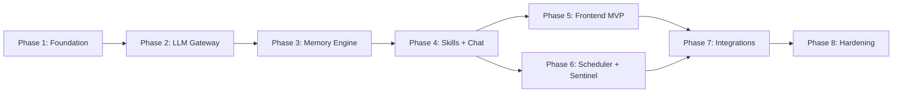

# Talon Implementation Strategy

## Phasing Rationale

Neither pure horizontal (thin MVP across everything) nor pure vertical (complete each domain in isolation) is the right call here. The dependency graph dictates a natural build order, and your requirement that each phase deploys to the VPS means every phase must produce a running system.

The strategy is **progressive vertical**: build complete, tested subsystems in dependency order, with each phase extending the prior deployed artifact. OpenClaw can be stopped at any point -- there is no parallel-running constraint.




---

## Phase 1: Foundation

**Goal:** A running FastAPI shell on the VPS with infrastructure, config, logging, database, and test harness. No business logic yet.

**Delivers:**

- Project scaffolding: `pyproject.toml` (uv), `Makefile`, `docker-compose.yml`, `.gitignore`
- FastAPI app factory with lifespan context manager (`[backend/app/main.py](backend/app/main.py)`)
- Pydantic `BaseSettings` with `secrets_dir` (`[backend/app/core/config.py](backend/app/core/config.py)`)
- structlog configuration + `SecretMasker` processor (`[backend/app/core/logging.py](backend/app/core/logging.py)`)
- Error hierarchy: `TalonError`, `AllProvidersDown`, etc. (`[backend/app/core/errors.py](backend/app/core/errors.py)`)
- Middleware: `CorrelationIDMiddleware`, `RateLimitMiddleware` (`[backend/app/core/middleware.py](backend/app/core/middleware.py)`)
- Security: API key auth helpers (`[backend/app/core/security.py](backend/app/core/security.py)`)
- `dependencies.py` with `get_db` wired, other providers stubbed (`[backend/app/dependencies.py](backend/app/dependencies.py)`)
- PostgreSQL + pgvector via Docker Compose, Alembic initialized
- `GET /api/health` returning basic status (`[backend/app/api/health.py](backend/app/api/health.py)`)
- Test infrastructure: `conftest.py` with `db_session`, `mock_gateway`, `client` fixtures
- Deploy configs: `talon.service`, `nginx.conf` (templates, wired to real deploy)
- `config/secrets/` directory structure with placeholder instructions

**Verification on VPS:**

```
make services-up && make migrate && make dev
curl http://localhost:8000/api/health  # returns {"status": "healthy"}
make test  # passes
```

**Personas involved:** Architect, Backend Engineer, DevOps, QA

---

## Phase 2: LLM Gateway

**Goal:** The system can send a message to an LLM provider and receive a streamed response. Circuit breaker and fallback chain are operational.

**Delivers:**

- `CircuitBreaker` dataclass with state machine (`[backend/app/llm/circuit_breaker.py](backend/app/llm/circuit_breaker.py)`)
- Retry with exponential backoff + jitter (`[backend/app/llm/retry.py](backend/app/llm/retry.py)`)
- `LLMGateway` with fallback chain via LiteLLM (`[backend/app/llm/gateway.py](backend/app/llm/gateway.py)`)
- `LLMResponse`, `LLMRequest`, `ProviderConfig` Pydantic models (`[backend/app/llm/models.py](backend/app/llm/models.py)`)
- `config/providers.yaml` parser + loader
- `GET /api/sse/{session_id}` basic SSE streaming endpoint (`[backend/app/api/sse.py](backend/app/api/sse.py)`)
- `get_gateway` dependency wired in `dependencies.py`
- Health endpoint enhanced: now reports per-provider circuit breaker status
- Full gateway test suite: primary success, fallback after threshold, all-providers-down, circuit breaker recovery, half-open probe

**Verification on VPS:**

```
curl -X POST http://localhost:8000/api/chat -d '{"message":"hello","session_id":"test"}'
curl http://localhost:8000/api/health | jq .providers
make test-chaos  # circuit breaker stress tests pass
```

**Personas involved:** Backend Engineer, Architect, QA

---

## Phase 3: Memory Engine

**Goal:** The LLM receives structured context in every prompt -- core identity, relevant past conversations, and current session state.

**Delivers:**

- `MemoryCompressor`: Markdown to JSON matrix compiler (`[backend/app/memory/compressor.py](backend/app/memory/compressor.py)`)
- Memory source files: `identity.md`, `user_preferences.md`, `long_term.md`, `capabilities.md` (`[data/memories/](data/memories/)`)
- `EpisodicMemory` SQLAlchemy model + Alembic migration with pgvector column
- `EpisodicStore`: save turn + async embedding generation, cosine similarity retrieval (`[backend/app/memory/episodic.py](backend/app/memory/episodic.py)`)
- `WorkingMemoryStore`: per-session dict with GC (`[backend/app/memory/working.py](backend/app/memory/working.py)`)
- `MemoryEngine` orchestrator: builds system prompt from all three tiers (`[backend/app/memory/engine.py](backend/app/memory/engine.py)`)
- `GET /api/memory` inspection endpoint (`[backend/app/api/memory.py](backend/app/api/memory.py)`)
- `get_memory` dependency wired
- Health endpoint enhanced: reports `core_tokens` and `episodic_count`
- Tests: compressor parsing, token budget enforcement, deduplication, episodic retrieval ranking, working memory GC

**Verification on VPS:**

```
curl http://localhost:8000/api/health | jq .memory
curl http://localhost:8000/api/memory  # shows core_matrix + stats
make test  # memory tests pass
```

**Personas involved:** Data Engineer, Backend Engineer, QA

---

## Phase 4: Skills Engine + Chat Router

**Goal:** Complete chat pipeline -- message in, context assembled, LLM called, tools invoked, response streamed back. This is the **functional backend MVP**.

**Delivers:**

- `BaseSkill` ABC, `ToolDefinition`, `SkillResult` (`[backend/app/skills/base.py](backend/app/skills/base.py)`)
- `SkillRegistry`: scan directory, dynamic import, namespace tools (`[backend/app/skills/registry.py](backend/app/skills/registry.py)`)
- `SkillExecutor`: `asyncio.wait_for` timeout wrapper (`[backend/app/skills/executor.py](backend/app/skills/executor.py)`)
- Two initial skills ported from OpenClaw:
  - `searxng_search` (low complexity, validates the full skill lifecycle)
  - `yahoo_finance` (low complexity, second data point)
- `ChatRouter`: unified entry point for all platforms (`[backend/app/api/chat.py](backend/app/api/chat.py)`)
- Full tool-calling loop in SSE stream (token, tool_start, tool_result, done, error events)
- `POST /api/chat` wired end-to-end
- `GET /api/skills` registry inspection endpoint (`[backend/app/api/skills.py](backend/app/api/skills.py)`)
- `get_registry` dependency wired
- Tests: executor timeout, exception wrapping, registry scan/load/namespace, chat endpoint integration

**Verification on VPS:**

```
curl -X POST http://localhost:8000/api/chat \
  -H 'Content-Type: application/json' \
  -d '{"message":"What is AAPL stock price?","session_id":"test"}'
# Full tool-calling loop executes, response includes tool_start + tool_result
curl http://localhost:8000/api/skills | jq  # shows loaded skills
```

**Personas involved:** Skills Developer, Backend Engineer, Architect, QA

---

## Phase 5: Frontend MVP

**Goal:** A usable web UI for daily chatting with Talon. Streamed responses, tool-use indicators, health dashboard.

**Delivers:**

- Vite + React 18 + TypeScript scaffolding (`[frontend/](frontend/)`)
- TailwindCSS v4 + daisyUI v5 configuration
- Chat components: `ChatWindow`, `MessageList`, `MessageBubble`, `ChatInput`
- `useSSE` hook with auto-reconnect and exponential backoff
- Zustand `chatStore` (messages, session, connection state)
- API client module (`[frontend/src/api/client.ts](frontend/src/api/client.ts)`)
- `HealthDashboard` with per-provider status cards
- Light/dark theme support via `data-theme`
- Vitest component tests for key components
- nginx config updated to serve `frontend/dist/` + proxy `/api/`*

**Verification on VPS:**

```
make build  # builds frontend/dist/
# Browser: https://your-domain/ shows chat UI
# Type a message, see streamed response with tool indicators
# Health dashboard shows provider status
```

**Personas involved:** Frontend Engineer, DevOps, QA

---

## Phase 6: Scheduler + Sentinel

**Goal:** The system maintains itself -- memory recompiles, logs rotate, idle sessions are cleaned up, skills hot-reload on file change.

**Delivers:**

- `TalonScheduler` wrapping `AsyncIOScheduler` with PostgreSQL jobstore (`[backend/app/scheduler/engine.py](backend/app/scheduler/engine.py)`)
- Built-in jobs: `memory_recompile`, `llm_health_sweep`, `log_rotate`, `working_memory_gc`, `episodic_archive`, `session_cleanup` (`[backend/app/scheduler/jobs.py](backend/app/scheduler/jobs.py)`)
- `FileSentinel` with watchdog `Observer` (`[backend/app/sentinel/watcher.py](backend/app/sentinel/watcher.py)`)
- `EventRouter`: dispatches file events to registry reload, memory recompile, config reload (`[backend/app/sentinel/tree.py](backend/app/sentinel/tree.py)`)
- `GET/POST /api/scheduler/jobs` management endpoint (`[backend/app/api/scheduler.py](backend/app/api/scheduler.py)`)
- Both wired into FastAPI lifespan (start on boot, stop on shutdown)
- `get_scheduler` dependency wired
- Health endpoint enhanced: reports job count and running state
- Tests: job registration, EventRouter dispatch logic (handler, not OS events)

**Verification on VPS:**

```
# Edit data/memories/identity.md on the VPS
# Within seconds, core_matrix.json recompiles (check via /api/memory)
# Edit a skill file -- registry hot-reloads (check via /api/skills)
curl http://localhost:8000/api/scheduler/jobs | jq  # shows all registered jobs
```

**Personas involved:** Backend Engineer, Architect, QA

---

## Phase 7: Integrations + Remaining Skills

**Goal:** All platforms connected (Discord, Slack, webhooks). All OpenClaw skills ported.

**Delivers:**

- `BaseIntegration` ABC (`[backend/app/integrations/base.py](backend/app/integrations/base.py)`)
- `DiscordIntegration` via `discord.py` (`[backend/app/integrations/discord.py](backend/app/integrations/discord.py)`)
- `SlackIntegration` via `slack_bolt` Socket Mode (`[backend/app/integrations/slack.py](backend/app/integrations/slack.py)`)
- Generic webhook receiver (`[backend/app/integrations/webhook.py](backend/app/integrations/webhook.py)`)
- Remaining skills ported: `weather_enhanced`, `hostinger_email`, `news_sentinel`
- Integration startup/shutdown wired into lifespan (conditional on config/secrets availability)
- Tests: integration message routing through ChatRouter (mocked platform clients)

**Verification on VPS:**

```
# Send a Discord DM to the bot -- get a response
# Send a Slack message -- get a response
# All skills appear in /api/skills
```

**Personas involved:** Backend Engineer, Skills Developer, QA

---

## Phase 8: Hardening + Migration

**Goal:** Production-grade reliability. OpenClaw data migrated. Security audited. System is the daily driver.

**Delivers:**

- Migration scripts: `migrate_memories.py`, `episodic_import.sql`, `migrate_skills.py`, `migrate_config.py`, `validate_migration.py` (`[scripts/](scripts/)`)
- OpenClaw episodic logs imported to PostgreSQL
- Playwright E2E test suite: chat flow, SSE reconnect, error states, health dashboard
- LLM quality evaluation suite (`@pytest.mark.llm_eval`)
- Chaos tests: all-providers-down, DB connection loss, skill timeout storms
- Security audit: permissions verification, CORS enforcement, rate limit testing, secret masking validation
- Frontend polish: memory viewer panel, log viewer panel, virtual scrolling for long conversations
- `README.md` fully written with setup instructions
- Final deploy with SSL (Let's Encrypt via certbot)
- OpenClaw service decommissioned

**Verification on VPS:**

```
make test && make test-e2e && make test-chaos
make deploy
make health  # all green
# OpenClaw service stopped and disabled
```

**Personas involved:** All personas

---

## Phase Dependency Summary

- **Phase 1** has no dependencies (greenfield)
- **Phase 2** depends on Phase 1 (needs config, logging, app factory)
- **Phase 3** depends on Phase 1 (needs DB, Alembic)
- **Phase 4** depends on Phases 2 + 3 (needs gateway + memory for chat pipeline)
- **Phase 5** depends on Phase 4 (needs API endpoints to exist)
- **Phase 6** depends on Phases 3 + 4 (needs memory + skills to schedule/watch)
- **Phase 7** depends on Phases 4 + 6 (needs ChatRouter + hot-reload)
- **Phase 8** depends on all prior phases

Phases 2 and 3 can theoretically be built in parallel since they depend only on Phase 1. However, serial execution is simpler for a single developer and avoids merge conflicts in shared files like `dependencies.py` and `main.py`.

---

## Estimated Effort per Phase

- Phase 1 (Foundation): **Large** -- most boilerplate, but straightforward
- Phase 2 (Gateway): **Medium** -- well-defined, code samples in plan docs
- Phase 3 (Memory): **Medium** -- pgvector setup is the main complexity
- Phase 4 (Skills + Chat): **Large** -- ties everything together, most integration surface
- Phase 5 (Frontend): **Medium-Large** -- full React app from scratch
- Phase 6 (Scheduler + Sentinel): **Small-Medium** -- clear scope, few unknowns
- Phase 7 (Integrations): **Medium** -- Discord/Slack SDKs, skill porting
- Phase 8 (Hardening): **Medium** -- testing, migration scripts, polish

