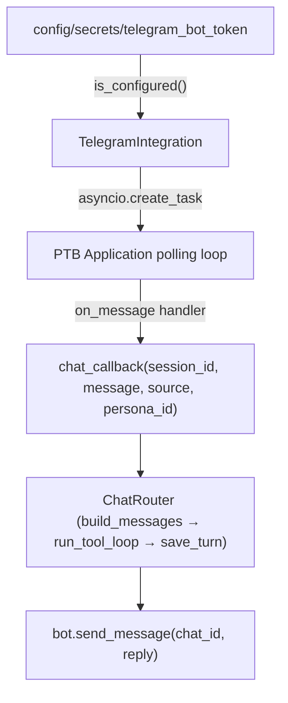

# Telegram Integration

## Pattern Reference

All integrations follow this established contract in `[backend/app/integrations/](backend/app/integrations/)`:




## Files to Change

### 1. `backend/pyproject.toml`

Add optional dependency (mirrors the `discord` and `slack` extras):

```toml
telegram = ["python-telegram-bot>=21.0"]
```

### 2. `backend/app/integrations/base.py`

Update the `platform` field description on `IncomingMessage` to include `telegram`:

```python
platform: str = Field(..., description="discord | slack | telegram | webhook")
```

### 3. `backend/app/integrations/telegram.py` — **new file**

Mirrors `discord.py` structure:

- `is_configured()` — checks `config/secrets/telegram_bot_token` exists
- `start()` — reads token, builds a `python-telegram-bot` `Application`, registers a `MessageHandler` for all text messages (private chats + group mentions), creates `asyncio.Task` that runs `application.initialize() → updater.start_polling() → application.start()`
- `stop()` — calls `updater.stop() → application.stop() → application.shutdown()`, cancels task
- `status()` / `_connected` / `_error` fields match existing pattern
- Session ID: `telegram_{chat_id}` (consistent with `discord_{channel_id}`, `slack_{channel}`)
- Message splitting: Telegram's limit is 4096 chars; reuse a `_split_message` helper

Key difference from Discord/Slack: `python-telegram-bot` v21 has a structured async lifecycle (`initialize`, `start`, `updater.start_polling`, `stop`, `shutdown`) rather than a single blocking coroutine, so the task runs a small `_run_polling` coroutine that calls these in sequence and awaits `asyncio.Event` to block until stop is requested.

### 4. `backend/app/dependencies.py`

In `init_integrations()`, import and register `TelegramIntegration` alongside Discord and Slack:

```python
from app.integrations.telegram import TelegramIntegration
# ...
_integration_manager.register(
    TelegramIntegration(chat_callback=chat_callback, persona_registry=persona_registry)
)
```

### 5. `config/personas.yaml`

Add a placeholder Telegram channel binding to the `analyst` persona (consistent with existing Discord/Slack placeholders):

```yaml
- platform: telegram
  channel_id: "PLACEHOLDER"
```

### 6. `backend/tests/test_integrations/test_telegram.py` — **new file**

Mirrors `test_discord.py`:

- `test_not_configured_when_no_secret`
- `test_status_default`
- `test_start_without_secret_logs_warning`
- `test_stop_idempotent`
- `test_chat_callback_invoked`
- `test_split_message_short` / `test_split_message_long` (4096 limit)

## Notes

- **Polling vs webhook**: Polling is the right choice here — it requires no public URL config change and matches the approach used by both Discord (`client.start`) and Slack (Socket Mode). A single VPS with one operator doesn't need webhook push delivery.
- **Secret file**: `config/secrets/telegram_bot_token` — get the token from BotFather (`/newbot`). No second token needed (unlike Slack's two-token setup).
- **Group chats**: Telegram bots in groups only receive messages when they are mentioned or when group privacy mode is disabled. The handler will filter for DMs and `@mention` text to stay consistent with the Discord/Slack behaviour.

